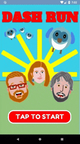

# Dash Run

Remember the days of 8bit computing where we only had a few Kb to 
play with, the games were very simple and the graphics terrible? 
This is my take on an 8bit game, with simple game play and terrible 
graphics! This game is 'loosely' based on Centipede.

#### Introduction

Dash and the Dashlets have escaped! The Flutter team has been dispatched
to capture them and bring them safely back home.

#### Running the game

Clone the repo with: git clone https://github.com/amugofjava/dash_run.git

Change to the dash_run directory and then execute: flutter run

#### Playing the game

Swipe left and right to move your team member. Tap to throw a net. If
Dash, or one of the Dashlets, manages to reach the ground and peck the
Flutter team member, the game ends.

#### Third party libraries

I wanted to see what I could build within the 5Kb limit and just the
Flutter SDK. As such, this app does not use any plugins or additional packages.

#### License

The source is made available under the MIT license. See the LICENSE file for details.
